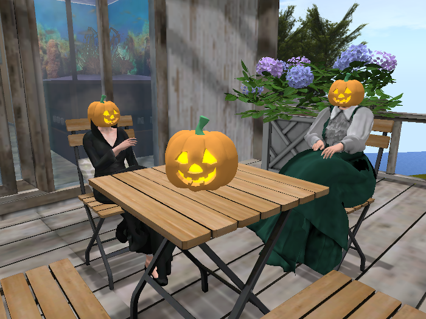
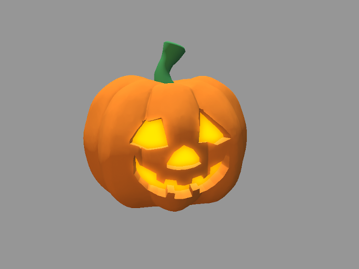

# Fourmilab Pumpkin Head

[Fourmilab Pumpkin Head](https://marketplace.secondlife.com/p/Fourmilab-Pumpkin-Head-and-Decoration/22695803)
is a jack-o'lantern (pumpkin carved with a face, lit from within) which 
may be worn as a head with both mesh and classic avatars, or used as a 
static decoration for Halloween and other occasions.   It includes a 
script that allows you to configure its behaviour via chat commands, 
and provides features such as brightening the glow of the light when 
you're typing in chat.

This repository contains all of the software and resources, including 
programs in Linden Scripting Language, textures, notecards, and 
development documentation, tools, and resources used the model and its 
development.  The actual model is built within Second Life and these 
components are installed within it.

The
[complete package](https://marketplace.secondlife.com/p/Fourmilab-Pumpkin-Head-and-Decoration/22695803)
is available for free in the Second Life Marketplace.  This repository 
contains everything in the model (except the mesh and prim, which are 
objects built within Second Life), plus additional resources for 
developers who may wish to extend or adapt the model as they wish.  The 
model is delivered with "full permissions": those who obtain it are 
free to copy, modify, and transfer it to other users within Second 
Life.

All of this software is licensed under the Creative Commons 
Attribution-ShareAlike license.  Please see
[LICENSE.md](LICENSE.md) in this repository for details.

Please see the
[Fourmilab Pumpkin Head User Guide](notecards/pumpkin_head_user_guide.nc)
for details.
